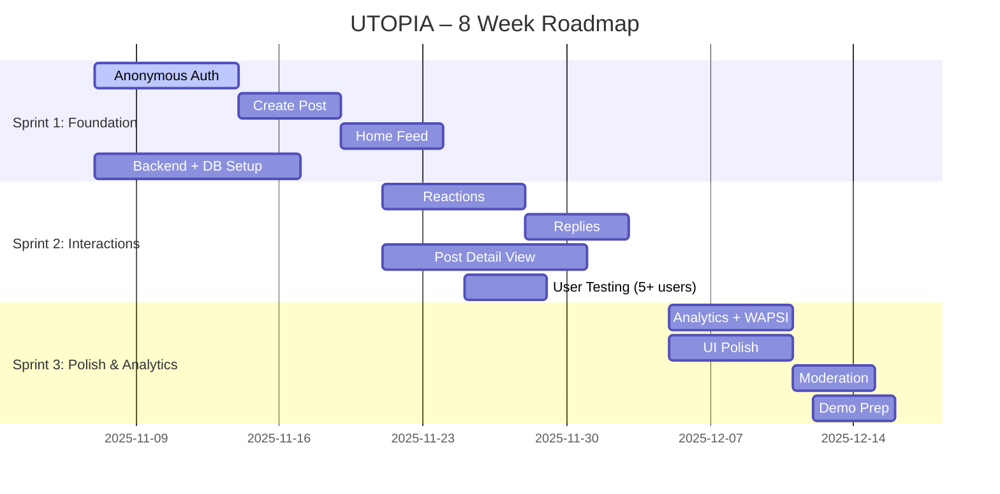

# 📅 Product Roadmap — UTOPIA

**Version:** 1.0
**Team:** UTOPIA
**Date:** 2025-11-07
**Document:** `/03-build/roadmap/product-roadmap.md`

---

# 🗺️ 8-Week Product Roadmap

### From Evidence → MVP → Validation → Demo

This roadmap outlines how UTOPIA will be built across **3 sprints (Weeks 7–12)**.
It is based on validated interview insights, the final problem statement, and the MVP scope.

---

## 🎯 Product Direction (Summary)

UTOPIA helps KIU students experiencing **stress, isolation, and fear of judgment** by enabling them to **share their emotional struggles anonymously** and receive **instant supportive peer interactions**.

Our MVP focuses on delivering:

1. **Anonymous post creation**
2. **Viewing peer stories and stress moments**
3. **Supportive reactions (emojis)**
4. **Simple replies**
5. **Home feed showing community experiences**
6. **Basic user identification (anonymous IDs, not names)**
7. **Analytics instrumentation for WAPSI (Weekly Active Peer-Support Interactions)**

---

# 🧭 Roadmap Overview Table

| Sprint       | Weeks       | Theme                          | Main Deliverables                                  |
| ------------ | ----------- | ------------------------------ | -------------------------------------------------- |
| **Sprint 1** | Weeks 7–8   | Foundation & Core Experience   | Auth (anonymous), Create Post, View Feed, DB setup |
| **Sprint 2** | Weeks 9–10  | Interaction & User Testing     | Reactions, Replies, UX refinement, 5+ user tests   |
| **Sprint 3** | Weeks 11–12 | Polish & Analytics Integration | WAPSI analytics, performance polish, demo prep     |

---

# 🥅 Sprint 1 — Foundation & Core Experience

**Weeks:** 7–8
**Theme:** Make the app functional enough for a student to **share and view** emotional struggles anonymously.

### 🎯 Sprint 1 Goals

- Establish **technical foundation** (FE, BE, DB).
- Implement **core functionality** required for emotional sharing.
- Enable **basic workflow:** anonymous user → create post → view feed.

### 🚀 Features Implemented (from MVP)

1. **Anonymous Authentication**

   - Generate unique anonymous ID (not tied to personal data).
   - Store in local storage.

2. **Create Emotional Post (Text Input)**

   - Simple, low-friction form.
   - Character limit for safety.
   - Stores timestamp + category.

3. **Home Feed (Read-Only)**

   - Latest posts sorted by recency.
   - No interactions yet (just view).

4. **Database & Backend Setup**

   - Postgres schema: users, posts.
   - API: createPost, getFeed.

5. **Basic Error Handling (Frontend + Backend)**

   - Safe fallbacks for network issues.

### 📌 Validation Activities

- Internal team testing (each team member creates 2 posts).
- Check that anonymous IDs persist across refresh.
- Load testing for feed (min 50 posts).

### ✔️ Success Criteria

- User can anonymously create a post.
- User can view community posts.
- Zero PII stored anywhere.
- All APIs respond <300ms in local environment.

---

# 💬 Sprint 2 — Interaction & User Testing

**Weeks:** 9–10
**Theme:** Enable **peer-support interactions** and collect qualitative feedback.

### 🎯 Sprint 2 Goals

- Enable peer reactions & replies.
- Conduct user testing with **5+ KIU students**.
- Validate whether interactions reduce feeling of isolation.

### 🚀 Features Implemented

1. **Supportive Reactions (Emoji Set)**

   - ❤️ “I feel you”
   - 🤝 “Same situation”
   - 🌱 “You're not alone”
     (Chosen based on interview patterns of needed _validation_.)

2. **Simple Replies**

   - Short supportive messages (max 100 chars).
   - No usernames.

3. **Post Detail View**

   - Tap a post → view replies + reactions.

4. **Feed Quality Improvements**

   - Show reaction count.
   - “New replies” indicator.

5. **User Testing (5+ Participants)**

   - Conduct guided usability tests.
   - Measure emotional response (“Do you feel less alone after reading?”).
   - Gather feedback for Sprint 3.

### 📌 Validation Activities

- 5 moderated user tests.
- UX survey (Likert scale on emotional resonance).
- Heatmap-style data from session recordings (optional).

### ✔️ Success Criteria

- 70%+ users able to create + react + reply without guidance.
- Users report **feeling less alone** after using the feed.
- No harmful or offensive content identified (basic filters work).
- Backend supports reactions with <350ms latency.

---

# ⭐ Sprint 3 — Polish, Safety & Analytics

**Weeks:** 11–12
**Theme:** Refine emotional experience + instrument analytics for Sprint Demo.

### 🎯 Sprint 3 Goals

- Polish user experience.
- Add safety & content moderation basics.
- Implement WAPSI (North Star Metric).
- Prepare final demo for Week 12.

### 🚀 Features Implemented

1. **Analytics (WAPSI Instrumentation)**

   - Track:
     `post_created`
     `post_viewed`
     `reply_created`
     `reaction_added`
     `interaction_recorded` (server-side)

2. **Performance Improvements**

   - Feed pagination.
   - Faster DB queries.
   - Optimized image sizes (if any).

3. **Safety & Content Moderation**

   - Basic keyword filter for self-harm, insults
   - Auto-hide harmful content

4. **UI Polish**

   - Better spacing & typography
   - Zero-friction “Create Post” UX
   - Improved color palette for emotional comfort

5. **Final Demo Prep**

   - Script
   - Slides
   - Demo flow rehearsals

### 📌 Validation Activities

- Dashboard view for WAPSI
- Verify all events firing to analytics
- 2nd round of feedback from 2–3 students

### ✔️ Success Criteria

- WAPSI visible in analytics dashboard
- 95% event delivery success
- Polished demo-ready UI
- Stable performance with 100+ test posts

---

# ⚠️ Risks & Mitigation

| Risk                               | Likelihood | Impact | Mitigation                                            |
| ---------------------------------- | ---------- | ------ | ----------------------------------------------------- |
| Students post harmful content      | Medium     | High   | Implement keyword filters + auto-hide + manual review |
| Slow reactions feed                | Medium     | Medium | Add lightweight caching + pagination                  |
| Team velocity slower than expected | High       | Medium | Keep MVP extremely narrow (5–8 features)              |
| Over-complex auth                  | Low        | High   | Use anonymous local ID only (no email/phone)          |
| Analytics failing                  | Medium     | Medium | Add server-side batching & staging tests              |

---

# 📊 Visual Timeline (Simple Gantt)

---

# ✅ Final Deliverables by Week 12

- Working MVP of UTOPIA
- WAPSI dashboard
- User-tested emotional support flow
- 3 sprints completed
- Demo-ready frontend + backend
- Documentation in `/03-build/` complete
